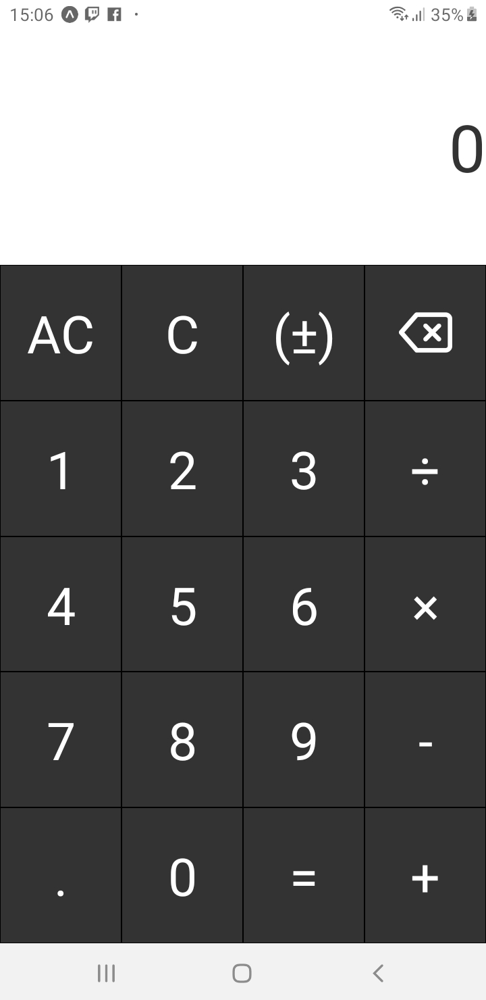
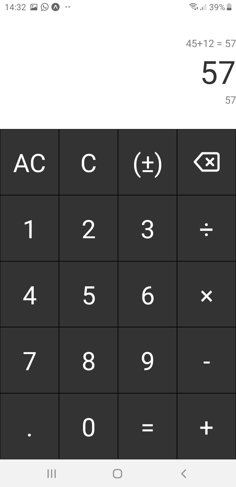
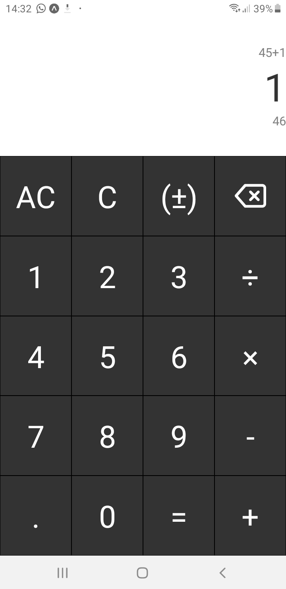

# Calculator

  
  
  

## Reference of project

https://github.com/florinpop17/app-ideas

## User Stories

-   [x] User can see a display showing the current number entered or the
        result of the last operation.
-   [x] User can see an entry pad containing buttons for the digits 0-9,
        operations - '+', '-', '/', and '=', a 'C' button (for clear), and an 'AC'
        button (for clear all).
-   [x] User can enter numbers as sequences up to 8 digits long by clicking on
        digits in the entry pad. Entry of any digits more than 8 will be ignored.
-   [x] User can click on an operation button to display the result of that
        operation on: 
	  - ~~The result of the preceding operation and the last number entered OR~~ 
	  - ~~The last two numbers entered OR~~ 
          - ~~The last number entered~~
-   [x] User can click the 'C' button to clear the last number or the last
        operation. If the users last entry was an operation the display will be
        updated to the value that preceded it.
-   [x] User can click the 'AC' button to clear all internal work areas and
        to set the display to 0.
-   [x] User can see 'ERR' displayed if any operation would exceed the
        8 digit maximum.

## Bonus features

-   [x] User can click a '+/-' button to change the sign of the number that is
        currently displayed.
-   [x] User can see a decimal point ('.') button on the entry pad to that
        allows floating point numbers up to 3 places to be entered and operations to
        be carried out to the maximum number of decimal places entered for any one
        number.
-   [ ] Update project to Typescript.
-   [x] Add styled-components on project.
-   [x] Add operations history and a preview of the result.
